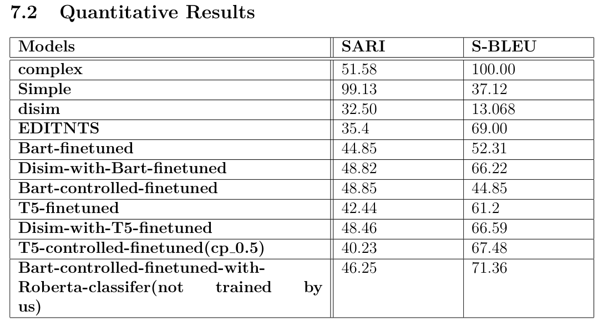
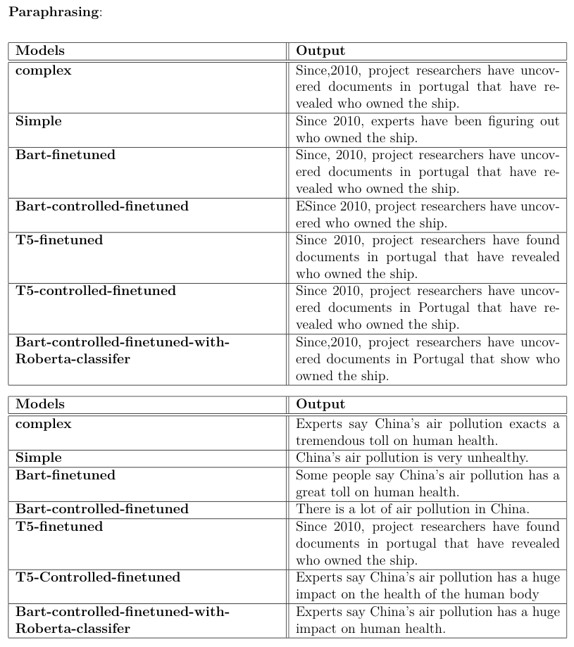

# Controllable Text Simplification

> ANLP Course Project
>
> - Presentation: [link](https://docs.google.com/presentation/d/1WMXAJBXYVPzT5U6KPxg8R3E4cKFOS19UyyO1TJBMx1M/edit?usp=sharing)
> - Report: [pdf](./Report.pdf)

## Team

| Name             | Roll No.   |
| ---------------- | ---------- |
| Aparna Agarwal   | 2021121007 |
| Shreya Patil     | 2021121009 |
| Adhiraj Deshmukh | 2021121012 |

## Results

**Quantitative Results**

**Qualitative Results**

- More Results: [Notion Page](https://frost-coal-647.notion.site/Results-31fbda5da88e44cf98cbf172d6dca14e?pvs=4)

## Checkpoints

- T5 on Wiki-Auto: https://huggingface.co/mrm8488/t5-small-finetuned-text-simplification
- Others: https://iiitaphyd-my.sharepoint.com/:f:/g/personal/aparna_agrawal_research_iiit_ac_in/EuVC1yIAXshFv2TQVnoLgxgByUBYhP7O3GjoBUKzGGJ1AQ?e=xAPcj7

---

## References

- Controllable Text Simplification with Explicit Paraphrasing: https://aclanthology.org/2021.naacl-main.277/
- DisSim: https://aclanthology.org/W19-8662/
- Controllable Sentence Simplification: https://aclanthology.org/2020.lrec-1.577/
- Controllable Sentence Simplification via Operation Classification: https://aclanthology.org/2022.findings-naacl.161/
